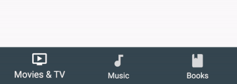
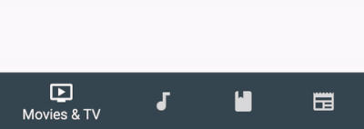

# Material Design Bottom Navigation for react-native

A detailed component based on [Material Guideline's Bottom Navigation](https://material.io/guidelines/components/bottom-navigation.html).

* Support for iOS and Android
* Uses those dope Ripple Transitions between two background colors
* Fully animated
* Fully customizable
* Switches automatically between Fixed Navigation (up to 3 tabs) and Shifting Navigation (3 - 5 tabs)


 

## Install

(Note: Currently not published. Not yet.)

```sh
# via npm
$ npm install react-native-material-bottom-navigation --save

# via yarn
$ yarn add react-native-material-bottom-navigation
```

## But how?

```jsx
import React, { Component } from 'react'
import BottomNavigation, { Tab } from 'react-native-material-bottom-navigation'
import Icon from 'react-native-vector-icons/MaterialIcons'

class MyComponent extends Component {
  render() {
    return (
      <BottomNavigation
        labelColor="white"
        rippleColor="white"
        style={styles.bottomNavigation}
        onTabChange={(newTabIndex) => alert(`New Tab at position ${newTabIndex}`)}
      >
        <Tab
          barBackgroundColor="#37474F"
          label="Movies & TV"
          icon={<Icon size={24} color="white" name="tv" />}
        />
        <Tab
          barBackgroundColor="#00796B"
          label="Music"
          icon={<Icon size={24} color="white" name="music-note" />}
        />
        <Tab
          barBackgroundColor="#5D4037"
          label="Books"
          icon={<Icon size={24} color="white" name="book" />}
        />
        <Tab
          barBackgroundColor="#3E2723"
          label="Newsstand"
          icon={<Icon size={24} color="white" name="newspaper" />}
        />
      </BottomNavigation>
    )
  }
}
```

## Configuration

### BottomNavigation

| Prop | Description  | Type | Defaut |
|------|--------------|------|--------|
| **`activeTab`** | Index of the preselected Tab, starting from 0. | `number` | `0` |
| **`labelColor`** | Text Color of the Tab's Label. Can be overwritten by the Tab itself. | `string` | `rgba(0, 0, 0, 0.54)` |
| **`rippleColor`** | Color of the small Ripple Effect when the Tab will be pressed. Can be overwritten by the Tab itself. | `string` | `black` |
| **`backgroundColor`** | Background color of the Bottom Navigation. Can be overwritten by the Tab itself, to achive different background colors for every active Tab. | `string` | `white` |
| **`onTabChange`** | Function to be called when a Tab was clicked an changes. Will be called with parameters `(newTabIndex, oldTabIndex) => {}`. | `function` | `noop` |
| **`style`** | Style will be directly applied to the component. | `object` | – |

### Tab

| Prop | Description  | Type | Defaut |
|------|--------------|------|--------|
| **`icon`** | **Required.** Component to render as icon. Should be have height and width of `24`. | `ReactElement<*>` | – |
| **`label`** | **Required.** Text of the label. | `string` | – |
| **`labelColor`** | Text Color of Label. Will use `labelColor` of BottomNavigation as default. | `string` | `rgba(0, 0, 0, 0.54)` |
| **`barBackgroundColor`** | Background color for the whole component, if the tab is active. Will use `backgroundColor` of BottomNavigation as default. | `string` | `white` |
| **`rippleColor`** | Color of the small Ripple Effect when the Tab will be pressed. Will use `rippleColor` of BottomNavigation as default. | `string` | `black` |
