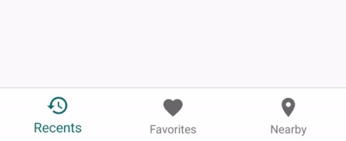
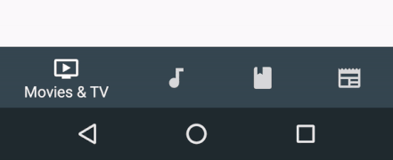

# Material Design Bottom Navigation for react-native

A highly accurate Bottom Navigation Component for react-native, based on [Material Guidelines' Bottom Navigation](https://material.io/guidelines/components/bottom-navigation.html).

* Support for iOS and Android (it's programmed only in JavaScript)
* Uses those dope Ripple Transitions between two background colors
* Follows the Material Design Guidelines
* Switches automatically between Fixed Navigation (up to 3 tabs) and Shifting Navigation (3 - 5 tabs)
* No dependencies
* Support for [react-navigation](https://reactnavigation.org)

The Bottom navigation looks lovely. That's probably the reason why you're here. Using a Bottom Navigation is a good choice. More and more apps are switching from a Burger Menu and/or [Tabs](https://material.io/guidelines/components/tabs.html) to a Bottom Navigation, including Google Apps.

**Fixed Bottom Navigation**

 

**Shifting Bottom Navigation**

 

**Behind the Android System Navigation Bar**




- [Install](#install)
- [But how? (Usage)](#but-how)
- [Configuration](#configuration)
- [Behind the Navigation Bar](#behind-the-navigation-bar)
- [Usage for react-navigation](#usage-for-react-navigation)
- [Roadmap](#roadmap)
- [LICENSE](#license)

## Install

```sh
# via npm
$ npm install react-native-material-bottom-navigation --save

# via yarn
$ yarn add react-native-material-bottom-navigation
```


## But how?

This is an example for a Bottom Navigation with 4 Tabs, each Tab has its own background color.

In this example, I used [react-native-vector-icons](https://github.com/oblador/react-native-vector-icons) as Icon Components. You can use whatever Component you want.

```jsx
import React, { Component } from 'react'
import BottomNavigation, { Tab } from 'react-native-material-bottom-navigation'
import Icon from 'react-native-vector-icons/MaterialIcons'

class MyComponent extends Component {
  render() {
    return (
      <BottomNavigation
        labelColor="white"
        rippleColor="white"
        style={{ height: 56, elevation: 8, position: 'absolute', left: 0, bottom: 0, right: 0 }}
        onTabChange={(newTabIndex) => alert(`New Tab at position ${newTabIndex}`)}
      >
        <Tab
          barBackgroundColor="#37474F"
          label="Movies & TV"
          icon={<Icon size={24} color="white" name="tv" />}
        />
        <Tab
          barBackgroundColor="#00796B"
          label="Music"
          icon={<Icon size={24} color="white" name="music-note" />}
        />
        <Tab
          barBackgroundColor="#5D4037"
          label="Books"
          icon={<Icon size={24} color="white" name="book" />}
        />
        <Tab
          barBackgroundColor="#3E2723"
          label="Newsstand"
          icon={<Icon size={24} color="white" name="newspaper" />}
        />
      </BottomNavigation>
    )
  }
}
```

## Configuration

Don't skip this part. You will be happy to know about all the good stuff you can configure here.

**Note:** If you are searching for more customization options, like label styles for fonts/positioning/..., they are *intentionally* not supported. More and more customizations would be actively against the Material Design Guidelines, and I want to encourage you to follow the Guidelines.

### BottomNavigation

| Prop | Description  | Type | Defaut |
|------|--------------|------|--------|
| **`activeTab`** | Index of the preselected Tab, starting from 0. | `number` | `0` |
| **`labelColor`** | Text Color of the Tab's Label. Can be overwritten by the Tab itself. | `string` | `rgba(0, 0, 0, 0.54)` |
| **`activeLabelColor`** | Text Color of the active Tab's Label. Can be overwritten by the Tab itself. | `string` | `labelColor` |
| **`rippleColor`** | Color of the small Ripple Effect when the Tab will be pressed. Has opacity of `0.12`. | `string` | `black` |
| **`backgroundColor`** | Background color of the Bottom Navigation. Can be overwritten by the Tab itself, to achive different background colors for each active Tab. | `string` | `white` |
| **`onTabChange`** | Function to be called when a Tab was clicked and changes into active state. Will be called with parameters `(newTabIndex, oldTabIndex) => {}`. | `function` | `noop` |
| **`style`** | **Required.** Style will be directly applied to the component. Use this to set the height of the BottomNavigation (should be 56), to position it, to add shadow and border. The only pre-set rule is `overflow: hidden`. | `object` | **Required.** |
| **`innerStyle`** | All tabs are wrapped in another container. Use this to add styles to this container. The main reason why you would want to use this is to put the Navigation behind the Android System Navigation Bar. See below for an example on how to achieve this. | `object` | – |
| **`shifting`** | Turn manually on/off shifting mode. | `boolean` | `true` if > 3 Tabs, otherwise `false` |

**Hints:**

- Elevation should be `8`
- Height should be `56`
- Width should be 100%
- Follow all specs defined in the [Official Guidelines](https://material.io/guidelines/components/bottom-navigation.html#bottom-navigation-specs)


### Tab

| Prop | Description  | Type | Defaut |
|------|--------------|------|--------|
| **`icon`** | **Required.** Component to render as icon. Should have height and width of `24`. | `ReactElement<*>` | **Required.** |
| **`activeIcon`** | Component to render as icon when the Tab is active. Should have height and width of `24`. Use this to change the color of the icon. | `ReactElement<*>` | `icon` |
| **`label`** | **Required.** Text of the Label. | `string` | **Required.** |
| **`labelColor`** | Text Color of the Label. | `string` | `labelColor` of BottomNavigation |
| **`activeLabelColor`** | Text Color of the Label when the Tab is active. | `string` | `activeLabelColor` of BottomNavigation |
| **`barBackgroundColor`** | Background color for the whole component, if the tab is active. | `string` | `backgroundColor` of BottomNavigation |


## Behind the Navigation Bar

In the Material Design Guidelines you can see examples with the Bottom Navigation behind the Software Navigation Bar. That looks pretty sweet. In theory, that's pretty simple. In practice there's a problem: Not every device has a visible Navigation Bar. If someone has hardware buttons on his phone, the Navigation Bar is usually hidden. As of now, we can't simply detect if it's visible. If you don't detect it and just add the following code, the BottomNavigation will have a huge padding-bottom on devices without a Navigation Bar.

See [Issue #28](https://github.com/timomeh/react-native-material-bottom-navigation/issues/28) for more informations with an initial proposal by @keeleycarrigan.

However, if you know what you're doing, you only need to adjust a few things:

**Step 1.** In order to make the System Navigation translucent, you have to add this to `android/app/src/main/res/values/styles.xml`:

```xml
<!-- Customize your theme here. -->
<item name="android:navigationBarColor">@android:color/transparent</item>
<item name="android:windowTranslucentNavigation">true</item>
```

**Step 2.** The System Navigation has a height of 48dp. The Bottom Navigation should be 56dp tall. This makes a total height of 104. Use `innerStyle` to push the tabs above the System Navigation without pushing the whole Bottom Navigation above it.

```jsx
<BottomNavigation
  style={{ height: 104, ... }}
  innerStyle={{ paddingBottom: 48 }}
>
```

**Step 3.** You're done!


## Usage for [react-navigation](https://reactnavigation.org)

This package includes a Component to plug into react-navigation. It is as configurable as the standalone version. To achieve this, it uses a separate configuration inside `tabBarOptions`. You can only set those configurations for the Bottom Navigation inside the `TabNavigatorConfig` of `TabNavigator()` – **not inside `static navigationOptions` or inside the `RouteConfigs`**.

The following example will explain everything you need to get started.

```jsx

import React from 'react'
import { NavigationComponent } from 'react-native-material-bottom-navigation'
import { TabNavigator } from 'react-navigation'
import { AppRegistry } from 'react-native';

class MoviesAndTV extends React.Component {
  static navigationOptions = {
    tabBarLabel: 'Movies & TV',
    tabBarIcon: () => (<Icon size={24} color="white" name="tv" />)
  }

  render() { ... }
}

class Music extends React.Component {
  static navigationOptions = {
    tabBarLabel: 'Music',
    tabBarIcon: () => (<Icon size={24} color="white" name="music-note" />)
  }

  render() { ... }
}

class Newsstand extends React.Component {
  static navigationOptions = {
    tabBarLabel: 'Newsstand',
    tabBarIcon: () => (<Icon size={24} color="white" name="Newsstand" />)
  }

  render() { ... }
}

const MyApp = TabNavigator({
  MoviesAndTV: { screen: MoviesAndTV },
  Music: { screen: Music },
  Newsstand: { screen: Newsstand }
}, {
  tabBarComponent: NavigationComponent,
  tabBarPosition: 'bottom',
  tabBarOptions: {
    bottomNavigationOptions: {
      labelColor: 'white',
      rippleColor: 'white',
      tabs: {
        MoviesAndTV: {
          barBackgroundColor: '#37474F'
        },
        Music: {
          barBackgroundColor: '#00796B'
        },
        Newsstand: {
          barBackgroundColor: '#EEEEEE',
          labelColor: '#434343', // like in the standalone version, this will override the already specified `labelColor` for this tab
          activeLabelColor: '#212121',
          activeIcon: <Icon size={24} color="#212121" name="newsstand" />
        }
      }
    }
  }
})

AppRegistry.registerComponent('MyApp', () => MyApp)
```

### [TabNavigatorConfig](https://reactnavigation.org/docs/navigators/tab#TabNavigatorConfig)

- `tabBarComponent`: Use `NavigationComponent` provided by `react-native-material-bottom-navigation`.
- `tabBarPosition`: Use `bottom`.
- `tabBarOptions`: react-navigation's configuration of the tab bar.


### tabBarOptions

The only options, which will affect the Bottom Navigation, are the following:

- `style`: Corresponds to the `style` prop of [`BottomNavigation`](#BottomNavigation). If no height is specified, it will use `height: 56`. This way you don't need any styling in most cases.
- `bottomNavigationOptions`: The options for the Bottom Navigation, see below.


### bottomNavigationOptions

All options of [`BottomNavigation`](#BottomNavigation) are available. They behave like the options in the standalone version, including fallback- and default-behaviour.

- **`labelColor`**
- **`activeLabelColor`**
- **`rippleColor`**
- **`backgroundColor`**
- **`style`**: If specified, `tabBarOptions.style` won't be used.
- **`innerStyle`**
- **`shifting`**
- **`tabs`**: Configuration for the tabs, see below.

*Note: `activeTab` and `onTabChange` don't have any effect, since this is handled by react-navigation.*


### tabs

Each tab can be configured by its key from `RouteConfigs`. *If you take a look at the example, you will see that `MoviesAndTV`, `Music` and `Newsstand` correspond to each other.*

- **`tab`** is an object with `{ [routeKey]: tabOptions }`

### tabOptions

All options of [`Tab`](#Tab) are available. They behave like the options in the standalone version, including fallback- and default-behaviour.

- **`icon`**: If not specified, the icon inside `static navigationOptions.tabBar` of the scene will be used.
- **`activeIcon`**
- **`label`**: If not specified, the label inside `static navigationOptions.tabBar` of the scene will be used.
- **`labelColor`**
- **`activeLabelColor`**
- **`barBackgroundColor`**


### Why don't you use all the options provided by react-navigation?

At the time I developed this, react-navigation was in an early beta stage. It wasn't easy to get those options and add new options. I could only access the configs inside `tabBarOptions`, hence everything is stored there.

## Roadmap

Check if they are any new features announced in the [Issues](https://github.com/timomeh/react-native-material-bottom-navigation/issues).

## [LICENSE](LICENSE.md)

MIT
