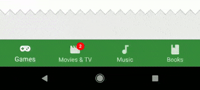
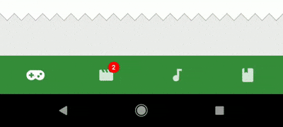

<h1 align="center">
  
</h1>

<br />

<p align="center">
  <a href="https://www.npmjs.com/package/react-native-material-bottom-navigation">
    
  </a>
  <a href="https://www.npmjs.com/package/react-native-material-bottom-navigation">
    
  </a>
</p>
<p align="center">
  <b>A beautiful, customizable and easy-to-use<br />Material Design Bottom Navigation for react-native.</b>
</p>

<br />

* **Pure JavaScript.** No native dependencies. No linking. No obstacles.
* **Looks beautiful.** Stunning and fluid animations. You won't believe it's not a native view.
* **Customize it.** You can adjust nearly everything to make it fit perfectly to your app.
* **Easy to use.** Uses established React patterns for both simple and advanced usage.
* **Pluggable.** Includes customizable Tabs and Badges. Not enough? Create and use your own!

<br />

## Installation

Using [npm](https://www.npmjs.com/):

```sh
npm install react-native-material-bottom-navigation
```

Or using [yarn](https://yarnpkg.com):

```sh
yarn add react-native-material-bottom-navigation
```

## Table of Contents

* [Installation](#installation)
* [Demo](#demo)
* [Usage](#usage)
* [Documentation](#documentation)
* [Notes](#notes)
* [Contribute](#contribute)
* [Authors](#authors)
* [License](#license)

## Demo

<p align="center">
  <br />
  <b>Shifting Tab</b>
</p>

<p align="center">
  <br />
  <b>Full Tab</b>
</p>

<p align="center">
  <br />
  <b>Icon Tab</b>
</p>

## Usage

This library uses ["render props"](https://reactjs.org/docs/render-props.html) as established pattern for component composition. The example below illustrates the basic usage of the Bottom Navigation. All available Props are listed in the [Documentation](#documentation).

Dive into the example below, check out [the example app](/examples/Playground) and take a look at the [Usage Documentation](https://timomeh.gitbook.io/material-bottom-navigation/usage).

```js
import BottomNavigation, {
  FullTab
} from 'react-native-material-bottom-navigation'

export default class App extends React.Component {
  tabs = [
    {
      key: 'games',
      icon: 'gamepad-variant',
      label: 'Games',
      barColor: '#388E3C',
      pressColor: 'rgba(255, 255, 255, 0.16)'
    },
    {
      key: 'movies-tv',
      icon: 'movie',
      label: 'Movies & TV',
      barColor: '#B71C1C',
      pressColor: 'rgba(255, 255, 255, 0.16)'
    },
    {
      key: 'music',
      icon: 'music-note',
      label: 'Music',
      barColor: '#E64A19',
      pressColor: 'rgba(255, 255, 255, 0.16)'
    }
  ]

  renderIcon = icon => ({ isActive }) => (
    <Icon size={24} color="white" name={icon} />
  )

  renderTab = ({ tab, isActive }) => (
    <FullTab
      isActive={isActive}
      key={tab.key}
      label={tab.label}
      renderIcon={this.renderIcon(tab.icon)}
    />
  )

  render() {
    return (
      <View style={{ flex: 1 }}>
        <View style={{ flex: 1 }}>
          {/* Your screen contents depending on current tab. */}
        </View>
        <BottomNavigation
          onTabPress={newTab => this.setState({ activeTab: newTab.key })}
          renderTab={this.renderTab}
          tabs={this.tabs}
        />
      </View>
    )
  }
}
```

**Note:** Out-of-the-box support for React Navigation (called `NavigationComponent` in earlier releases) was removed with v1. You can still use [an earlier version](https://github.com/timomeh/react-native-material-bottom-navigation/releases/tag/v0.9.0), or integrate the Bottom Navigation on your own. [Read more...](#react-navigation-support)

## Documentation

You can also view the entire documentation on GitBook: https://timomeh.gitbook.io/material-bottom-navigation/

* [Usage](/docs/Usage.md)
* [API Reference](/docs/api)
  * [`<Badge />`](/docs/api/Badge.md)
  * [`<BottomNavigation />`](/docs/api/BottomNavigation.md)
  * [`<FullTab />`](/docs/api/FullTab.md)
  * [`<IconTab />`](/docs/api/IconTab.md)
  * [`<ShiftingTab />`](/docs/api/ShiftingTab.md)

## Notes

### React Navigation Support

In contrary to earlier releases, this library _does not support_ React Navigation out of the box (called `NavigationComponent` in earlier releases). React Navigation now ships with an own Material Bottom Navigation: [`createMaterialBottomTabNavigator`](https://reactnavigation.org/docs/en/material-bottom-tab-navigator.html).

The API of React Navigation changes quite frequently, and (until now) it wasn't always easy to keep track of changes and be up-to-date. Also I don't want to favor and promote React Navigation over other Navigation Libraries.

You can still implement the Bottom Navigation on your own, for example by using React Navigation's [Custom Navigator](https://reactnavigation.org/docs/en/custom-navigator-overview.html).

If you integrate material-bottom-navigation with a navigation library in your project, feel free to share your knowledge by contributing to the Documentation or event create your own module which uses react-native-material-bottom-navigation.

### Updated Material Design Specs

Google updated the Material Guidelines on Google I/O 2018 with new specifications, including a slightly changed Bottom Navigation and a new "App Bar Bottom" with a FAB in a centered cutout. react-native-material-bottom-navigation uses the _older_ specs.

## Contribute

Contributions are always welcome. Read more in the [Contribution Guides](CONTRIBUTING.md).

Please note that this project is released with a Contributor [Code of Conduct](CODE_OF_CONDUCT.md). By participating in this project you agree to abide by its terms.

## Authors

**Author**

* Timo Mämecke ([GitHub](https://github.com/timomeh), [Twitter](https://twitter.com/timomeh))

**Contributors**

See [Contributors List](https://github.com/timomeh/react-native-material-bottom-navigation/contributors). Thanks to everyone!

## License

[MIT](LICENSE.md), © 2017 - present Timo Mämecke
